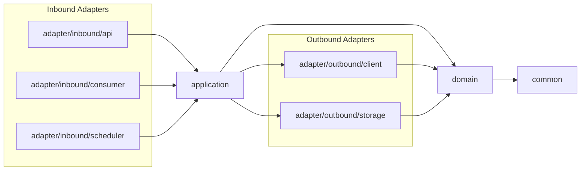
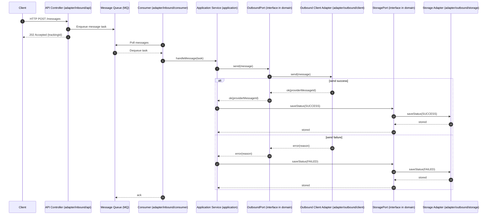

# MessageHub Project

> Documentation assisted by ChatGPT

---

## 1) 프로젝트 개요

**MessageHub**는 알림톡, SMS, Slack 등 다양한 메시지 채널을 통합 관리하는 메시지 허브 시스템입니다. 멀티 모듈 구조를 통해 각 모듈이 독립적인 역할을 수행하며, 클라이언트 요청은 단일 API
컨트롤러를 통해 입력되고 비동기 큐를 통해 처리됩니다.

---

## 2) 기술 스택 및 선정 이유

* **Kotlin**: 자바와 100% 호환, 더 간결하고 안정적인 문법.
* **Java 21 (LTS)**: Virtual Thread(Project Loom) 등 현대적 동시성 지원으로 고성능 비동기 처리에 유리.
* **Spring Boot 3.x**: Spring Framework 6 기반. Java 21/가상 스레드/Native Image 등 최신 기능 지원.
* **Gradle Multi-Project**: 모듈별 독립 빌드/배포 및 의존성 관리로 확장성과 유지보수성 향상.

---

## 3) 멀티 모듈 구조 (헥사고날 아키텍처)

```
message-hub/
├── common/                           // 공통 유틸리티 및 설정
│   ├── src/main/kotlin/
│   │   ├── enums/                    // 공통 열거형 (Environment, MDCKeyType)
│   │   ├── util/                     // 유틸리티 클래스
│   │   └── config/                   // 공통 설정
│   └── build.gradle.kts
├── domain/                           // 도메인 레이어 (핵심)
│   ├── src/main/kotlin/
│   └── build.gradle.kts
├── application/                      // 애플리케이션 레이어
│   ├── src/main/kotlin/service/      // 애플리케이션 서비스
│   └── build.gradle.kts
├── adapter/                          // 어댑터 레이어
│   ├── inbound/                      // 인바운드 어댑터 (Driving)
│   │   ├── api/                      // HTTP API 어댑터
│   │   │   ├── src/main/kotlin/api/
│   │   │   │   └── MessageHubApiApplication.kt
│   │   │   └── build.gradle.kts
│   │   ├── consumer/                 // 메시지 컨슈머 어댑터
│   │   │   ├── src/main/kotlin/consumer/
│   │   │   │   └── MessageHubConsumerApplication.kt
│   │   │   └── build.gradle.kts
│   │   └── scheduler/                // 스케줄러 어댑터
│   │       ├── src/main/kotlin/scheduler/
│   │       │   └── MessageHubSchedulerApplication.kt
│   │       └── build.gradle.kts
│   └── outbound/                     // 아웃바운드 어댑터 (Driven)
│       ├── client/                   // 외부 클라이언트 어댑터
│       │   ├── src/main/kotlin/
│       │   └── build.gradle.kts
│       └── storage/                  // 저장소 어댑터
│           ├── src/main/kotlin/
│           └── build.gradle.kts
└── build.gradle.kts                  // 루트 빌드 파일
```

### 모듈별 역할

* **common**: 공통 유틸/열거형/헬퍼/설정
* **domain**: 순수 도메인 모델, 포트(인터페이스), 유스케이스 정의
* **application**: 애플리케이션 서비스 (비즈니스 로직 오케스트레이션)
* **adapter/inbound/api**: HTTP API 컨트롤러 (REST 엔드포인트)
* **adapter/inbound/consumer**: 메시지 큐 컨슈머 (비동기 처리)
* **adapter/inbound/scheduler**: 스케줄러 (배치 작업)
* **adapter/outbound/client**: 외부 서비스(Slack, SMS 등) 호출 어댑터
* **adapter/outbound/storage**: 데이터 저장소 접근 어댑터

---

## 4) 처리 흐름

```
1) 메시지 수신:   [API Controller] → [Message Queue] 등록
2) 큐 폴링:      [Worker] ← [Message Queue] 폴링
3) 위임:         [Worker] → [Provider Service] 호출
4) 비즈니스 처리: [Provider] → [External Client] → [외부 서비스]
5) 결과 저장:     [Provider] → [External Storage] (상태 업데이트)
```

**ASCII 다이어그램**

```
[ Client ]
   │ HTTP
   ▼
[ api (Inbound) ] ─────────►  [ provider (Application) ]  ──►  [ domain (Core) ]
                                 │         ▲
                                 │         │ ports (interfaces)
                                 ▼         │
                        [ external/client, external/storage ]  (Outbound Adapters)

[ worker (Inbound) ] ── MQ ────────────────────────────────────▲
```

---

## 5) 계층 구조 및 접근 원칙 (헥사고날 아키텍처)

* **Inbound Adapters (`adapter/inbound/*`)**:
    - `api`: HTTP 요청/응답 처리, 입력 검증, 메시지 큐 등록
    - `consumer`: 메시지 큐 폴링 및 이벤트 수신
    - `scheduler`: 스케줄된 작업 실행
* **Application Layer (`application`)**: 비즈니스 로직 오케스트레이션, 유즈케이스 실행, 트랜잭션 경계 관리
* **Domain Layer (`domain`)**: 순수 도메인 모델, 엔티티/값객체/도메인 서비스, 포트(인터페이스) 정의
* **Outbound Adapters (`adapter/outbound/*`)**:
    - `client`: 외부 서비스(Slack, SMS 등) 호출 구현
    - `storage`: 데이터 저장소 접근 구현
* **Common Layer (`common`)**: 공통 유틸리티, 열거형, 설정

### 모듈 간 의존성 관계 (헥사고날 아키텍처)

* `adapter/inbound/*` → `application`, `domain`, `common`
* `application` → `domain`, `adapter/outbound/*`, `common`
* `adapter/outbound/*` → `domain`, `common`
* `domain` → `common`
* `common` → (무의존)

> **Note**:
> - **Inbound Adapters** (`api`, `consumer`, `scheduler`)는 모두 `application` 레이어를 호출합니다.
> - **Application Layer**는 비즈니스 로직 오케스트레이션을 담당하며, `domain`과 `outbound adapters`를 사용합니다.
> - **Outbound Adapters** (`client`, `storage`)는 `domain`에서 정의한 포트를 구현합니다.
> - **Domain Layer**는 순수한 비즈니스 로직과 포트(인터페이스)만 포함하며, 외부 의존성이 없습니다.

---

## 6) 예외 처리 전략

* `common.exception.BaseException`을 모든 도메인/애플리케이션 예외의 부모로 둠.
* 각 모듈 내부 `exception` 패키지에 특화 예외 정의.

```kotlin
// 공통 예외
package com.hjm.messagehub.common.exception

abstract class BaseException(message: String) : RuntimeException(message)

// 도메인/채널 특화 예외 예시
package com.hjm.messagehub.sms.exception

import com . hjm . messagehub . common . exception . BaseException

class SmsSendFailedException(message: String) : BaseException(message)
```

---

## 8) 트랜잭션 & OSIV(Open Session In View)

```yaml
spring:
  jpa:
    open-in-view: false
```

* 트랜잭션 경계를 **서비스/유즈케이스**에서 명확히 유지.
* Lazy 로딩은 반드시 서비스 계층 내에서 해결 후 DTO로 변환.
* 비동기 작업 중 세션/트랜잭션 누수를 방지.

---

## 9) 헥사고날 아키텍처 요약 (핵심 가치 & 창시자 의도)

> **Hexagonal Architecture (aka Ports & Adapters)** — *by Alistair Cockburn*

### 핵심 가치 (Core Values)

1. **독립성 (Independence)**: 비즈니스 로직은 웹/DB/MQ 등 기술로부터 독립적이어야 한다.
2. **대칭성 (Symmetry)**: REST, MQ, 배치, CLI 등 어떤 입력이든 동일한 코어를 호출할 수 있어야 한다.
3. **교체 용이성 (Replaceability)**: 어댑터(DB, 외부 API, 메시징)를 언제든 교체 가능해야 한다.

### 창시자의 의도

* “**도메인 로직이 환경(프레임워크/IO)에 오염되지 않도록**” 코어를 보호한다.
* 어댑터는 **바깥 세계와 연결되는 면(Ports의 구현체)**이며, 코어는 **Ports(인터페이스)** 만 정의한다.
* **테스트 용이성**: 테스트 하니스(테스트 더블)도 하나의 어댑터처럼 코어를 호출할 수 있어야 한다.

---

## 10) 개발 가이드

### 모듈별 규칙 (헥사고날 아키텍처)

* **Inbound Adapters** (`adapter/inbound/*`):
    - `api`: HTTP 엔드포인트/검증/큐 등록만. 비즈니스 로직 금지 → `application`에 위임
    - `consumer`: 메시지 큐 폴링/소비/재시도/데드레터 등 메시징 기술 관심사. 비즈니스 로직은 `application`에 위임
    - `scheduler`: 스케줄된 작업 실행. 비즈니스 로직은 `application`에 위임
* **Application Layer** (`application`): 유즈케이스/오케스트레이션/트랜잭션 경계. `domain` 포트 사용, `outbound adapters` 호출
* **Domain Layer** (`domain`): 엔티티/값객체/도메인 서비스/포트(인터페이스)만. 외부 의존성 금지
* **Outbound Adapters** (`adapter/outbound/*`): 외부 연동/저장소 접근의 구체 구현체만 포함. 비즈니스 규칙 금지
* **Common Layer** (`common`): 로깅/예외/유틸/열거형 등 횡단 관심사

### 트랜잭션

* 트랜잭션 시작/종료는 `application` 레이어의 유즈케이스 단위로 관리.
* 외부 연동 실패 시 재시도/백오프/서킷브레이커는 `adapter/outbound/*` 어댑터 레벨에서 담당(필요시 AOP/라이브러리).

---

## 11) CI/CD (GitHub Actions)

### 테스트 분류

* **Unit Tests**: `@Tag("unit")`
* **Integration Tests**: `@Tag("integration")`

### 실행 예시

```bash
# 모든 모듈 Unit 테스트 (CI 기본)
./gradlew test

# 모듈별 테스트
./gradlew :common:test
./gradlew :domain:test
./gradlew :application:test
./gradlew :adapter:inbound:api:test
./gradlew :adapter:inbound:consumer:test
./gradlew :adapter:inbound:scheduler:test
./gradlew :adapter:outbound:client:test
./gradlew :adapter:outbound:storage:test

# 통합 테스트만
./gradlew integrationTest

# 전체 (Unit + Integration)
./gradlew test integrationTest
```

### 워크플로우 개요

* **test.yml**: Ubuntu/Java21/Gradle, Unit 테스트, 결과 리포트(PR 체크)
* **build.yml**: 테스트 제외 빌드, 아티팩트 업로드
* **pr-check.yml**: 스타일/단위 테스트/빌드 검사, 결과 PR 댓글

#### 자동 실행 조건

* 브랜치: `main`, `develop`에 push
* PR 타깃: `feature/*`, `release/*`, `hotfix/*`, `main`, `develop`
* PR 이벤트: `opened`, `synchronize`, `reopened`, `ready_for_review`

---

## 12) Git 컨벤션

### 커밋 메시지

* 형식: `[TICKET-ID] prefix: 메시지`
* Prefix 예시: `feature:`, `fix:`, `refactoring:`

### 브랜치 전략 (Git Flow)

* **main**: 배포 브랜치
* **develop**: 통합 브랜치
* **feature/*, release/*, hotfix/*

### 브랜치별 자동 테스트

* feature → develop: 단위 테스트/빌드

* develop → main: 단위 테스트/빌드

* release → main: 전체 테스트(단위+통합)

* hotfix → main: 전체 테스트

* 커밋 트리는 **rebase**로 선형 유지.

---

## 13) 부록: Gradle 의존성 가드(권장 패턴)

> 레이어 역참조 방지를 위해 의존 방향을 명확히 합니다.

예) `settings.gradle.kts`에서 프로젝트 경로를 명시하고, 각 `build.gradle.kts`에서 아래처럼 제한:

```kotlin
// adapter/inbound/api/build.gradle.kts
dependencies {
    implementation(project(":application"))
    implementation(project(":domain"))
    implementation(project(":common"))
}

// adapter/inbound/consumer/build.gradle.kts
dependencies {
    implementation(project(":application"))
    implementation(project(":domain"))
    implementation(project(":common"))
}

// adapter/inbound/scheduler/build.gradle.kts
dependencies {
    implementation(project(":application"))
    implementation(project(":domain"))
    implementation(project(":common"))
}

// application/build.gradle.kts
dependencies {
    implementation(project(":domain"))
    implementation(project(":adapter:outbound:client"))
    implementation(project(":adapter:outbound:storage"))
    implementation(project(":common"))
}

// adapter/outbound/client & adapter/outbound/storage
dependencies {
    implementation(project(":domain"))
    implementation(project(":common"))
}

// domain/build.gradle.kts
dependencies {
    implementation(project(":common"))
}
```

> 필요시 아키텍처 테스트(ArchUnit 등)로 레이어 규칙을 CI에 반영해 위반을 자동 차단할 수 있습니다.

---

## 14) Mermaid Diagrams (아키텍처 시각화)

> 아래 다이어그램들은 GitHub / GitLab / Mermaid 지원 뷰어에서 바로 렌더링됩니다.

### 14.1 모듈 의존성 그래프 (헥사고날 아키텍처)



### 14.2 메시지 처리 플로우(시퀀스)



### 14.3 헥사고날(Ports & Adapters) 관점

```mermaid
flowchart LR
%% Orientation
    subgraph INBOUND["Inbound Adapters (Driving)"]
        API["HTTP API (adapter/inbound/api)"]
        CONSUMER["Consumer / MQ (adapter/inbound/consumer)"]
        SCHEDULER["Scheduler (adapter/inbound/scheduler)"]
    end

    subgraph CORE["Core (Application + Domain)"]
        APP["Application Layer (application)"]
        PORTS["Ports (Interfaces)\nDefined in domain"]
        DMN["Domain Model (domain)"]
    end

    subgraph OUTBOUND["Outbound Adapters (Driven)"]
        EXT_C["External Client (adapter/outbound/client)"]
        EXT_S["Storage (adapter/outbound/storage)"]
    end

%% Driving side calls application (input side)
    API --> APP
    CONSUMER --> APP
    SCHEDULER --> APP

%% Application uses domain and ports
    APP --> DMN
    APP -. uses .-> PORTS
%% Ports implemented by outbound adapters (output side)
    PORTS -. implemented by .-> EXT_C
    PORTS -. implemented by .-> EXT_S
%% Compile-time dependencies (one-way)
    EXT_C --> PORTS
    EXT_S --> PORTS
%% Visual grouping
    classDef inbound fill: #e3fcec, stroke: #2f855a;
    classDef core fill: #e6f0ff, stroke: #2b6cb0;
    classDef outbound fill: #fff5e6, stroke: #b7791f;
    class API, CONSUMER, SCHEDULER inbound;
    class APP, PORTS, DMN core;
    class EXT_C, EXT_S outbound;
```
